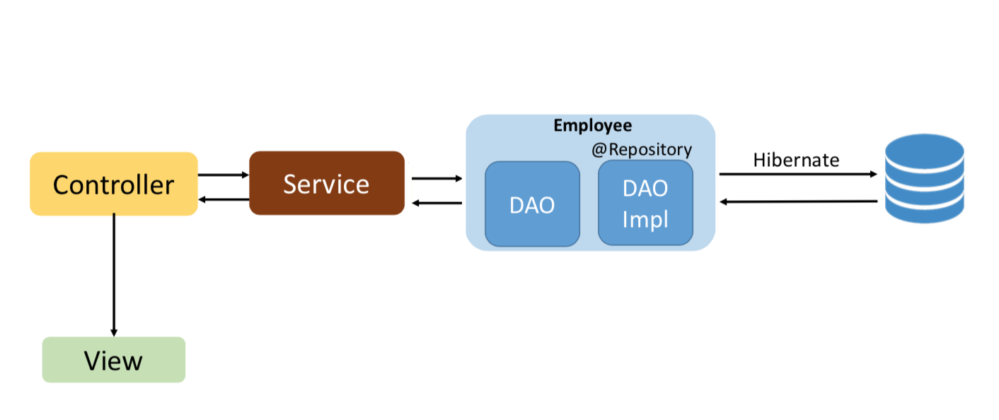

# Employee's rolodex 
This application stores and displays a list of company employees.

# About
Spring MVC application implements CRUD operations. Displays a list of employees.
Data is stored/written to SQL database. Interaction with the database is carried out using hibernate. The display takes place via view (JSP pages) using the local TomCat server.

The architecture of the application is built taking into account the Best Practice:

___

## Demo:
 

